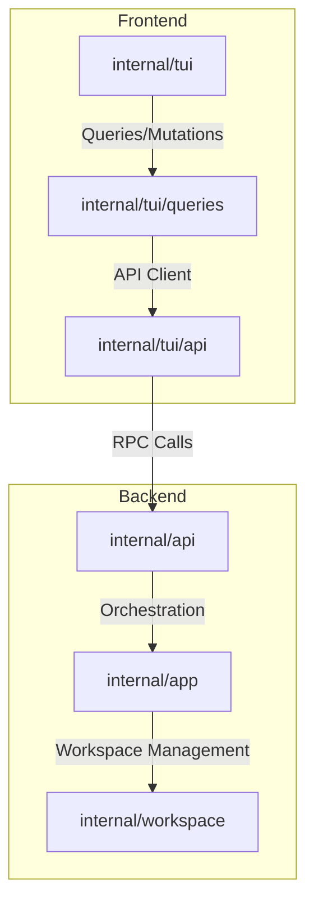

# Architecture Overview

TaskSmith is divided into clean internal modules that isolate application state, TUI rendering, API communication, and agent orchestration.

## 📦 Core Internal Packages

### `cmd/tasksmith`
The binary entry point. Parses command-line flags (logs level, workspace path, debug devtools address) using the `internal/app/flags` package, initializes application context, and handles shutdowns.

### `internal/app`
Coordinates the high-level application lifecycle:
- Registers terminal command handlers (`quit`, `theme`, `startinsert`, `stopinsert`).
- Configures workspace paths, loads local workspace registry profiles, and initializes the TUI renderer loop.
- Manages clean shutdowns by executing deferred cleanup callbacks (closing logs, unmapping unneeded buffers).

### `internal/api`
Defines data structures, request/response models, and serves as an interface layer between the frontend TUI and the backend workspace logic. It provides methods like `ListProjects`, `ListProviders`, and `InitializeWorkspace`.

### `internal/workspace`
Manages project resources, provider configurations, and custom tool definitions:
- Leverages the **Warp** library for parsing manifests.
- Reads embed preset model files to boot default configurations.
- Handles physical configuration writing during workspace initialization (sentinel validation, `.env` file generation, and `.gitignore` safety edits).

### `internal/core`
Holds utility structures:
- `log`: Structured `slog` wrappers supporting configurable output file logs (typically stored under `~/Library/Logs/tasksmith` on macOS).
- `xdg`: XDG Base Directory specification compliance helpers for locating data, config, and cache files.
- `fsutil`: Filesystem utilities for directory and file manipulations.
